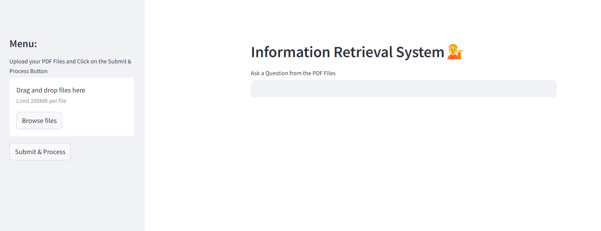

# 📚 Information Retrieval System


This is an AI-powered information retrieval system that allows users to upload PDFs and ask questions based on their content. It uses NLP and vector embeddings to fetch the most relevant answers.

## 🚀 Features
- Upload multiple PDF files
- AI-powered question-answering system
- Real-time chat interface
- Vector-based text search
- Elegant UI with Streamlit


## 📸 Screenshot


## 🔧 Setup
```
pip install -r requirements.txt
streamlit run app.py
```